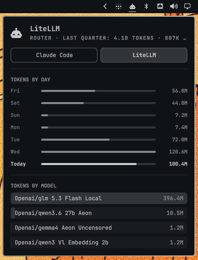

# LiteLLM Monitor — Omarchy shell plugin

Feeds your LiteLLM proxy usage into the **stock omarchy agents panel**: one
`litellm` tab among your other agents, with tokens by day, week (calendar
weeks), month, quarter, and year, a per-model breakdown, and request counts.

No bar icon, no extra panel — the plugin has no UI of its own. It ships a
headless **service** that polls your LiteLLM proxy every 10 minutes and
records usage to `~/.local/state/omarchy/agents/usage/litellm.json`, the same
record directory the agents panel already reads.

<p align="center">
  
</p>
<!-- screenshot: drop an updated capture here -->

## Install

```sh
omarchy plugin add https://github.com/reneil1337/omarchy-litellm-monitor --enable
```

Make sure the first-party `omarchy.agents` plugin is enabled (it provides the
panel and the bar icon).

## Configure

Edit `config.json` in the plugin folder:

```json
{
  "baseUrl": "http://your-litellm-host:4000",
  "apiKey": "sk-..."
}
```

`apiKey` must be able to *read* spend data. Recommended setup: create a
dedicated read-only user + key instead of pasting your master key.

In the LiteLLM admin UI: **Add user** → role **Admin (View Only)**
(`proxy_admin_viewer`) → then create a key for that user with **no team**
(a personal key inherits the view-only role). If that UI path is missing in
your version, mint it with your master key:

```bash
LITELLM_MASTER=sk-your-master-key

# 1. view-only admin user (result contains "user_id")
curl -sX POST http://your-litellm-host:4000/user/new \
  -H "Authorization: Bearer $LITELLM_MASTER" \
  -d '{"user_email":"dashboard@local.lan","user_role":"proxy_admin_viewer"}'

# 2. personal key owned by that user (result contains "key")
curl -sX POST http://your-litellm-host:4000/key/generate \
  -H "Authorization: Bearer $LITELLM_MASTER" \
  -d '{"user_id":"usr-..."}'
```

Paste the resulting `sk-...` into `config.json` and then:

```sh
chmod 600 ~/.config/omarchy/plugins/io.github.reneil1337.litellm/config.json
```

The `LITELLM_API_KEY` environment variable overrides `apiKey` if you'd
rather not store it on disk.

## Usage

Once the collector has produced a record, the agents panel gets a `litellm`
tab showing tokens and requests for your router. Force a refresh sooner
than the 10-minute interval with:

```sh
omarchy-shell io.github.reneil1337.litellm refresh
```

## Requirements

- Omarchy Quattro shell (recent `omarchy` with plugin support), with the
  first-party `omarchy.agents` plugin enabled
- `python3` (stdlib only — the collector has no pip dependencies)
- A reachable LiteLLM proxy (tested against LiteLLM API 1.101.0) with
  `/user/daily/activity` available to the key

Day groupings follow your local timezone. Token totals use the LiteLLM
canonical `total_tokens`; if your models have no pricing configured in the
proxy, `$` spend stays zero, but the token views are unaffected.

## How it works

The collector writes `litellm.json` to
`~/.local/state/omarchy/agents/usage/` — the shared record directory the
Omarchy agents panel reads. The record carries `history` (per-day tokens +
requests) and `modelDaily` (per-model per-day tokens), and the panel renders
it natively like any other agent: the tab, the daily chart, the per-model
table. Other tools can keep feeding that same directory.

## Remove

```sh
omarchy plugin remove io.github.reneil1337.litellm
```

## License

MIT — see [LICENSE](LICENSE).
