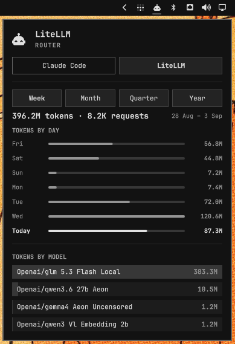
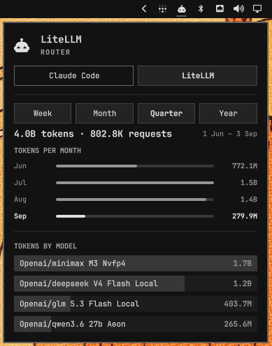

# LiteLLM Monitor — Omarchy shell plugin

One dashboard in your Omarchy bar for everything AI: the subscription agents
you've used locally (Claude, Codex, Fireworks — rate limits, pace, balance)
plus LiteLLM router tokens by day, week (calendar weeks), month, quarter, and
year, with a per-model breakdown and request counts.

Two pieces, both included:

- a headless **service** that polls your LiteLLM proxy and records usage
- a **bar widget + panel** showing a tab per agent (each with the full
  dashboard) — the LiteLLM tab carries the Week / Month / Quarter / Year
  selector, and the chart and model table re-slice on the selection

Install once and it appears next to the stock agents panel; hide either one
from the bar.

<table align="center">
  <tr>
    <td valign="top"></td>
    <td valign="top"></td>
  </tr>
</table>
<!-- previews: drop screenshots here -->

## Install

```sh
omarchy plugin add https://github.com/reneil1337/omarchy-litellm-monitor --enable
```

## Configure

Edit `config.json` in the plugin folder:

```json
{
  "baseUrl": "http://your-litellm-host:4000",
  "apiKey": "sk-..."
}
```

`apiKey` must be able to *read* spend data. Recommended setup: create a
dedicated read-only user + key instead of pasting your master key.

In the LiteLLM admin UI: **Add user** → role **Admin (View Only)**
(`proxy_admin_viewer`) → then create a key for that user with **no team**
(a personal key inherits the view-only role). If that UI path is missing in
your version, mint it with your master key:

```bash
LITELLM_MASTER=sk-your-master-key

# 1. view-only admin user (result contains "user_id")
curl -sX POST http://your-litellm-host:4000/user/new \
  -H "Authorization: Bearer $LITELLM_MASTER" \
  -d '{"user_email":"dashboard@local.lan","user_role":"proxy_admin_viewer"}'

# 2. personal key owned by that user (result contains "key")
curl -sX POST http://your-litellm-host:4000/key/generate \
  -H "Authorization: Bearer $LITELLM_MASTER" \
  -d '{"user_id":"usr-..."}'
```

Paste the resulting `sk-...` into `config.json` and then:

```sh
chmod 600 ~/.config/omarchy/plugins/io.github.reneil1337.litellm/config.json
```

The `LITELLM_API_KEY` environment variable overrides `apiKey` if you'd
rather not store it on disk.

## Kinds

| kind | what you get |
|------|--------------|
| `service` | collector, writes the usage record every 10 minutes |
| `bar-widget` | bar icon + dashboard panel with the window selector |

## Usage

Click the bar icon to open the dashboard; press Escape to close. Cycle the
window with the selector:

- **Week** — one bar per day (today highlighted)
- **Month** — one bar per calendar week
- **Quarter** — one bar per month
- **Year** — one bar per month, twelve months back

Tooltips carry exact ranges, token totals and request counts. The header
line under the selector totals the window (tokens and requests).

Force a refresh sooner than the 10-minute interval with:

```sh
omarchy-shell io.github.reneil1337.litellm refresh
```

## Requirements

- Omarchy Quattro shell (recent `omarchy` with plugin support)
- `python3` (stdlib only — the collector has no pip dependencies)
- A reachable LiteLLM proxy (tested against LiteLLM API 1.101.0) with
  `/user/daily/activity` available to the key

Day groupings follow your local timezone. Token totals use the LiteLLM
canonical `total_tokens`; if your models have no pricing configured in the
proxy, `$` spend stays zero, but the token views are unaffected.

## How it works

The collector writes `litellm.json` to
`~/.local/state/omarchy/agents/usage/` — the shared record directory the
Omarchy agents panel reads. This plugin ships its own bar widget (a
dedicated router view of that data) that renders the record's long-range
history: `history` (per-day tokens + requests) and `modelDaily` (per-model
per-day tokens). Other tools can keep feeding that same directory.

## Remove

```sh
omarchy plugin remove io.github.reneil1337.litellm
```

## License

MIT — see [LICENSE](LICENSE).
